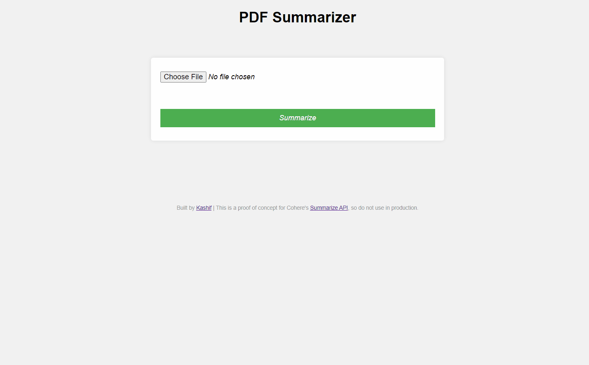

# PDF Summarizer

This tool users to upload a PDF file and obtain a quick summary of the text in a few sentences. This project was built as a proof of concept for Cohere's [Summarize APIs](https://docs.cohere.com/reference/summarize-2) and is not meant to be used in production, yet. 

## Demo
The demo below shows how you can get a brief summary of the [Attention is all you need](https://arxiv.org/abs/1706.03762) reseearch paper.

## Tech
The following key technology has been used in this project:
- [Multer](https://www.npmjs.com/package/multer): A Node.js middleware for file upload handling on the server.
- [PDF Parses](https://www.npmjs.com/package/pdf-parse): To extract text from the PDF file
- [Cohere Summarize APIs](https://docs.cohere.com/reference/summarize-2): To generate a brief summary of the text extracted from the PDF.

